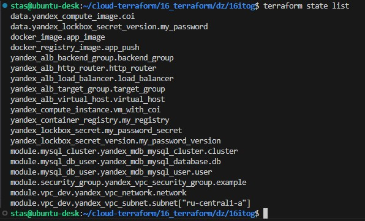
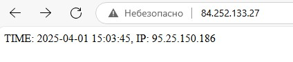
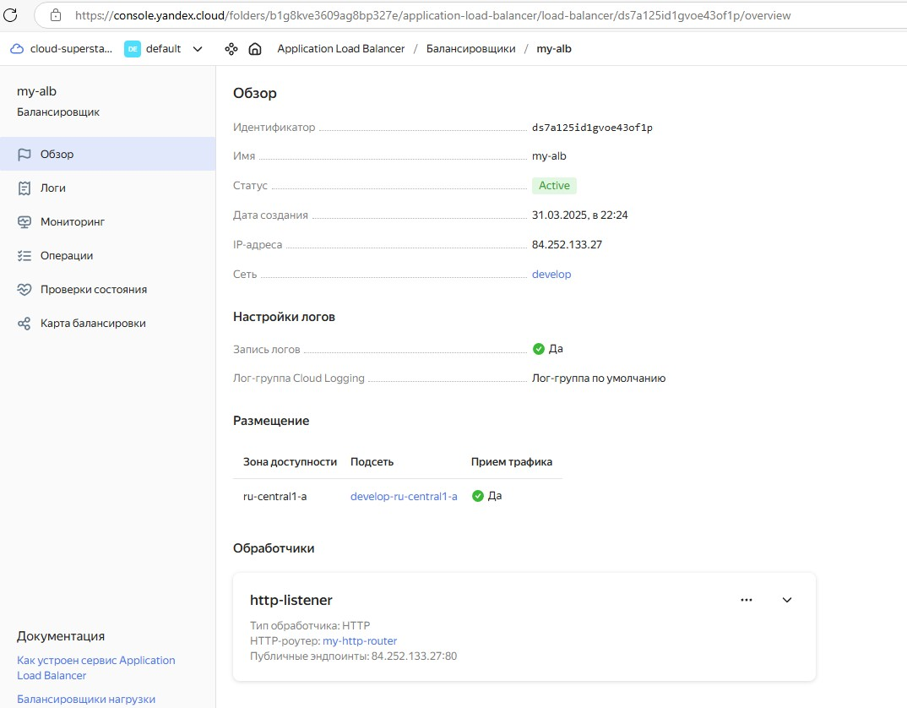
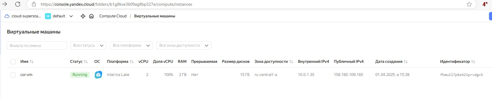
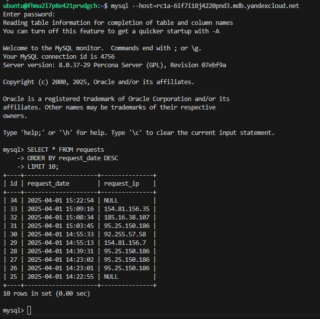

### Итоговый проект модуля «Облачная инфраструктура. Terraform» Помельников Станислав
https://github.com/Stas-91/terr_itog
### Описание итогового проекта:  

### Развернута инфраструктура в Yandex Cloud:
- Virtual Private Cloud
- группа безопасности (порты 22, 80, 443, 5000, 3306)
- Cluster MySQL
- ВМ Container Optimized Image
- балансировщик Application Load Balancer

### Приложение
- Сформирован Docker файл c web-приложением и сохранен контейнер в Container Registry

### Хранилище секретов LockBox
- Пароль от БД сохранен в хранилище LockBox

---

### Описание работы
Веб приложение работает из контейнера (yandex_compute_instance.vm_with_coi). Контейнер с приложением, после сборки образа (docker_image.app_image), загружается в реестр (yandex_container_registry.my_registry).  
Приложение подключаетя с использование SSL к БД (module "mysql_cluster", module "mysql_db_user"). Для этого был частично переписан код приложения из Задания 5 «Виртуализация и контейнеризация», чтобы можно было подключаться с использованием SSL.  
Приложение является целевой группой для баллансировщика нагрузки (yandex_alb_load_balancer.load_balancer).  
Пароль от БД хранится в LockBox (yandex_lockbox_secret.my_password_secret).  
Также реализована но не задействована ВМ (module "vm") с испольхованием cloud-init шаблона. Я решил максимально использовать возможности сервисов Яндекс и реализовал работу приложения на готовых сервисах.  
state хранится удаленно, подключен statelocking.  

https://github.com/Stas-91/terr_itog/blob/master/terraform_project.md

---

Я не держу инфраструктуру включенной (из-за стоимости), но если будет необходимо можно по согласованию развернуть ее для проверки.  
Ниже прилагаю некоторые скриншоты демонстриующие работоспособность:  

